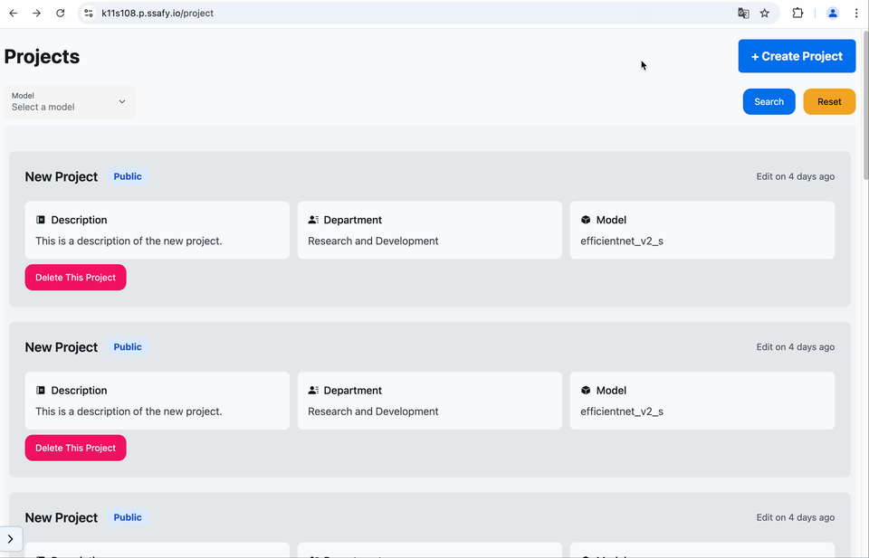
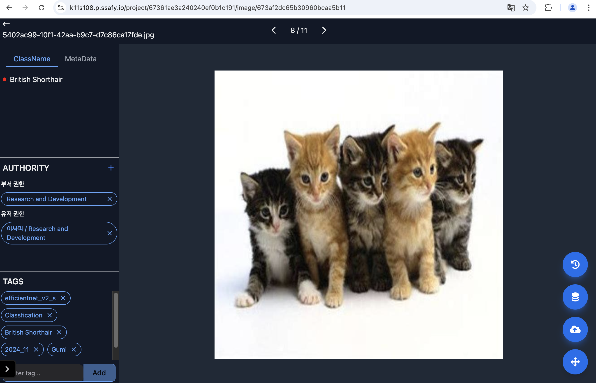

# 🌟 삼성 청년 SW 아카데미 11기 S108 🌟

# 🌳 프로젝트 개요

### ✨ 팀원

|  팀장  |  팀원  |  팀원  |  팀원  |  팀원  |  팀원  |
| :----: | :----: | :----: | :----: | :----: | :----: |
| 황병현 | 최현성 | 김호경 | 김경대 | 정재훈 | 최지훈 |

### 📅 기간

- 기획 및 설계 : 2024.10.14 - 2024.10.18
- 개발 : 2024.10.21 - 2024.11.19

# 💎 소개

### 🌃 기획 의도

Vision AI는 컴퓨터가 이미지를 인식하고 해석할 수 있게 하는 기술입니다.  
사람은 눈과 뇌를 통해서 이미지를 보고 무엇이 있는지를 인식하듯이  
컴퓨터는 이 기술을 이용해서 이미지를 분석합니다.

MLOps는 머신 러닝 자동 학습을 위한 파이프라인 구축 플랫폼 같은 것이며
머신러닝 모델을 실제 서비스에 안정적으로 적용하고 관리하는 방법론입니다.

저희는 이러한 것을 조합하여, 사용자에게 데이터를 받아서 자동으로 분석을 하여, Vision AI학습에 적합한 데이터를 선정하는 것을 목표를 두고 있습니다.

즉 저희 프로젝트의 목표는 Vision AI MLOps 구축을 위한 데이터 분석 플랫폼 개발이 목표입니다.
다만 완전한 자동화가 아닌, 사용자가 이미지들을 올리면 자동으로 분석을 하고, 해당 분석을 통한  
MLOps 구축하는 것입니다.

### 🔍 주요 기능

- 사용자에게 학습시킬 이미지 및 추가적인 데이터(MetaData, Feature 등)을 업로드 할 수 있으며, 반대로 이에 대한 분석 결과를 다운로드 할 수 있습니다.

- 이미지들에 대한 AI의 분석을 거치면 다차원 벡터(행렬)에 대한 값(Feature들)을 얻을 수 있으며, 그것들을 축소시켜서 2, 3차원으로 시각화가 가능합니다.

- 각 이미지마다 출처, 생성 시각, 모델 정보, 추론 결과 등에 대한 태그를 부여를 직접 할 수 있습니다.

- Vision 검사결과에 대해 다양한 옵션(AND, OR, NOT)으로 검색이 가능할 수 있습니다.

### 🌃 타겟층

AI를 통해서 불량을 검증하는 모든 제조업 및 공장을 타겟으로 잡고 있습니다.

# 🔨 Tech Stack 🔨

### Front End

### Back End

### DB

### Infra

### Team Collaboration Tools

### Architecture

# 🌍 서비스 기능

## 🎯 회원

### 이메일 인증 시스템 회원가입

### 자동 로그인

유효한 RefreshToken이 남아 있을 경우, 자동적으로 로그인 되도록 처리했습니다.

## 🎯 핵심 기능

(순서대로)

### 프로젝트 생성

프로젝트를 생성합니다.
여기서 다음과 같은 설정을 할 수 있습니다.

1. 모델 선택
2. 이름 및 설명
3. 공개 범위 설정

### 이미지 업로드

여러장에 대한 이미지 업로드.
추가적으로 zip 파일도 지원합니다.

### 이미지 태그 처리

각 이미지가 업로드가 되면, 서버에서 먼저 해당 이미지에 대해서
자동적으로 분석이 이루어집니다.

따라서 사용자는 미리 해당 이미지에 대한 여러가지 정보 및 메타 데이터들을 볼 수 있으며, 직접 수정도 가능합니다.

또한 각 이미지의 접근권한도 설정 할 수 있습니다.

### 분석

여러장에 대한 이미지를 (최소 10장이상) 선택하여 분석을 하면,  
각각 이미지들에 대한 Feature를 계산하여, 이를 Graph로 표현해 줍니다.

사용자를 이를 통해서 각각 이미지에 대한 특성을 확인할 수 있습니다.

# 🔆 기술

## 🖥️ Front End

### MiddleWare 및 쿠키를 이용한 접속&Fetch 제어

해당 프로젝트에서 핵심적인 기능에 대한 부분은 접근 권한이 매우 중요합니다.
Next.js 에서는 접속 할 때 Cookie에 담긴 정보를 이용해서 빠르게 접근을 제한 할 수 있습니다.

Cookie에는 유효시간이 매우 짧은 AccessToken, 그나마 긴 RefreshToken을 활용하여,
해당 AccessToken이 유효한지, 혹은 유효하지 않더라도 RefreshToken을 통해서 자동으로 토큰 재발급을 시도합니다.

해당 작업은 Next.js 에서 페이지 접속, Server Action, Route handler 등에 자동적으로 Middleware라는 곳을 거치며, 이를 이용해서 자동적으로 Authorization이 처리됩니다.

### 자동 로그인

처음 접속 할 때 refreshToken을 이용한 자동 로그인을 지원합니다.
이 또한 RefreshToken을 활용하여, 재 발급을 시도하며, 재 발급이 성공하면 그 즉시 로그인이 되도록 해 줍니다.

또한 유저 정보에 대한 호출은 Redux-toolkit의 thunk를 활용하여  
첫 접속시 바로 유저를 불러 올 수 있도록 하였습니다.

## 🖥️ Back End

### Classification & Object Detection

대량의 이미지를 분류하고 탐지하는 것은 시간을 오래 쓰는 일입니다.
AI를 활용하여 대량의 이미지를 분류하고 탐지하면 시간을 절약할 수 있습니다.

AI Server를 분리하여 Classification 모델 3개, Object Detection 모델 3개를 각 pre-traning시켜 weight를 부여하였습니다. 출력값 이전에 hook을 하여 각 이미지의 feature를 추출하고 Mongodb에 저장하였습니다.

해당 작업은 추출된 feature를 사용하여 API Server에서 차원축소를 진행하여 사용자에게 시각화 정보를 제공합니다.

